# 📚 Quizly - Online Quiz Platform

Quizly is an online quiz platform where **admins** create **users & teachers**, who in turn create quizzes for students. Students can take quizzes based on their enrolled courses.

---

## **🚀 First-Time Setup & Initialization**

When you **run the project for the first time**, the following steps automatically occur:

1. **Admin User is Created**

   - A default **admin user** is generated with credentials from `.env` file.
   - The admin is responsible for managing teachers, students, and quizzes.

2. **Default Course is Created**

   - A sample course named `"sample"` with code `"1001"` is added to the database.

3. **Teacher & Student Accounts are Created**

   - A **teacher** (`teacher1`) is linked to the default course.
   - A **student** (`student2`) is also linked to the default course.

4. **A Sample Quiz is Created**
   - A **quiz** with 10 sample questions is created for the default course.

---

## **🛠 How to Run the Project?**

### **1️⃣ Install Dependencies**

```sh
npm install
```

### **2️⃣ Setup Environment Variables**

Create a `.env` file in the root directory and configure your MongoDB and admin credentials:

```env
# --------- admin ------------------
ADMIN_NAME="admin"
ADMIN_PASSWORD="admin"
ADMIN_EMAIL="admin@quizly.com"
# --------- secret -----------------
JWT_SECRET="secretkey"
```

`.env` for `student` and `teacher`

```env
VITE_SECRET_KEY = "my_secret_key_123"
VITE_SERVER_KEY = "http://localhost:5000/api/v1"
```

### **3️⃣ Run the Project**

```sh
npm start
```

---

## **📌 What Happens After Running?**

- The database initializes with an **admin, teacher, student, course, and quiz** automatically.
- You can now log in as the admin using the credentials from `.env` to manage users and quizzes.
- Teachers can create new quizzes, and students can participate in them.

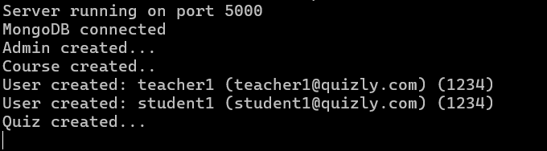

---

## **Initial Data**

1. **Course**
   ```json
   {
     "name": "Sample Course",
     "code": "1001"
   }
   ```
2. **Quiz**
   ```json
   {
     "title": "General Knowledge Quiz",
     "time": 5,
     "courseId": "<courseId>",
     "questions": [
       {
         "question": "What is the capital of France?",
         "options": ["Berlin", "Madrid", "Paris", "Rome"],
         "correctAnswer": "Paris"
       },
       {
         "question": "Who wrote 'To Kill a Mockingbird'?",
         "options": [
           "Harper Lee",
           "J.K. Rowling",
           "Ernest Hemingway",
           "Mark Twain"
         ],
         "correctAnswer": "Harper Lee"
       },
       {
         "question": "Which element has the chemical symbol 'O'?",
         "options": ["Oxygen", "Gold", "Osmium", "Iron"],
         "correctAnswer": "Oxygen"
       },
       {
         "question": "What is the largest planet in our solar system?",
         "options": ["Earth", "Mars", "Jupiter", "Saturn"],
         "correctAnswer": "Jupiter"
       },
       {
         "question": "Which year did World War II end?",
         "options": ["1942", "1945", "1939", "1950"],
         "correctAnswer": "1945"
       },
       {
         "question": "What is the square root of 64?",
         "options": ["6", "7", "8", "9"],
         "correctAnswer": "8"
       },
       {
         "question": "Which gas do plants absorb from the atmosphere?",
         "options": ["Oxygen", "Carbon Dioxide", "Nitrogen", "Hydrogen"],
         "correctAnswer": "Carbon Dioxide"
       },
       {
         "question": "Who painted the Mona Lisa?",
         "options": [
           "Vincent van Gogh",
           "Pablo Picasso",
           "Leonardo da Vinci",
           "Claude Monet"
         ],
         "correctAnswer": "Leonardo da Vinci"
       },
       {
         "question": "Which continent is the largest by area?",
         "options": ["North America", "Europe", "Asia", "Africa"],
         "correctAnswer": "Asia"
       },
       {
         "question": "What is the hardest natural substance on Earth?",
         "options": ["Gold", "Iron", "Diamond", "Quartz"],
         "correctAnswer": "Diamond"
       }
     ]
   }
   ```
3. **Users**

   ```json
   #--------------- Teacher ------------------
   {
     "name": "teacher1",
     "email": "teacher1@quizly.com",
     "password": "1234"
   }
   #--------------- Student ------------------
   {
     "name": "student1",
     "email": "student1@quizly.com",
     "password": "1234"
   }
   ```

---

## Screenshots

1. Student
   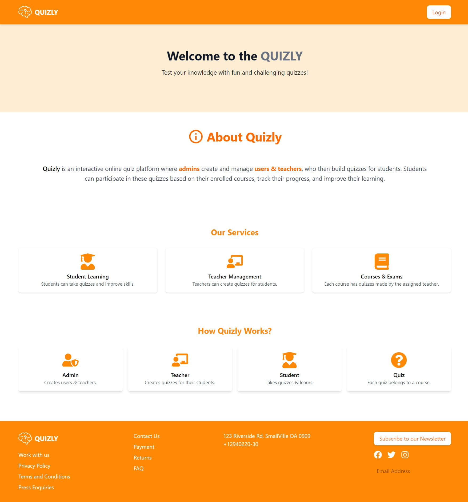
   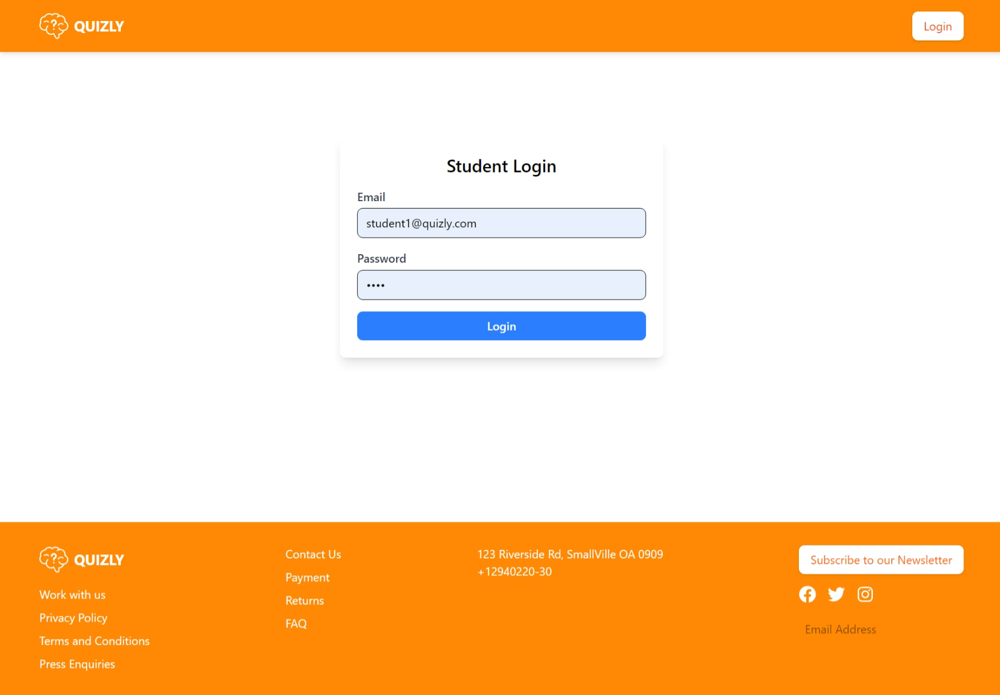
   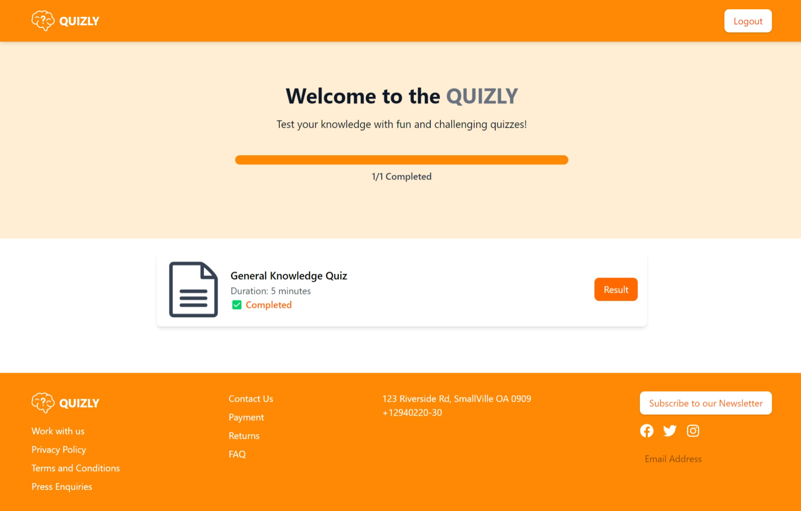
   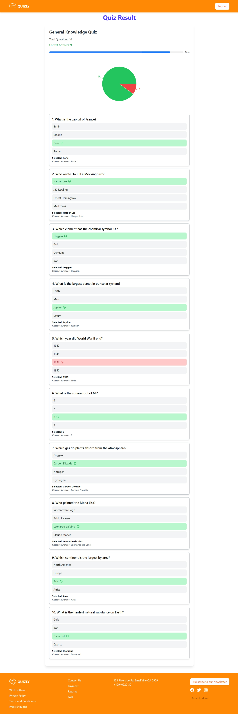

2. Admin & Teacher login
   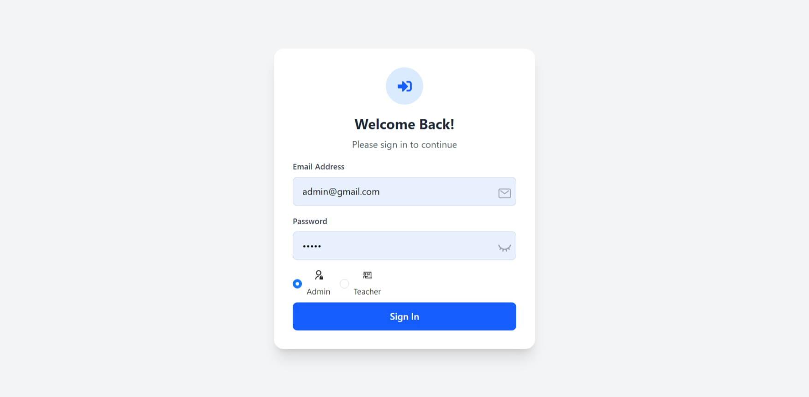

3. Teacher Dashboard
    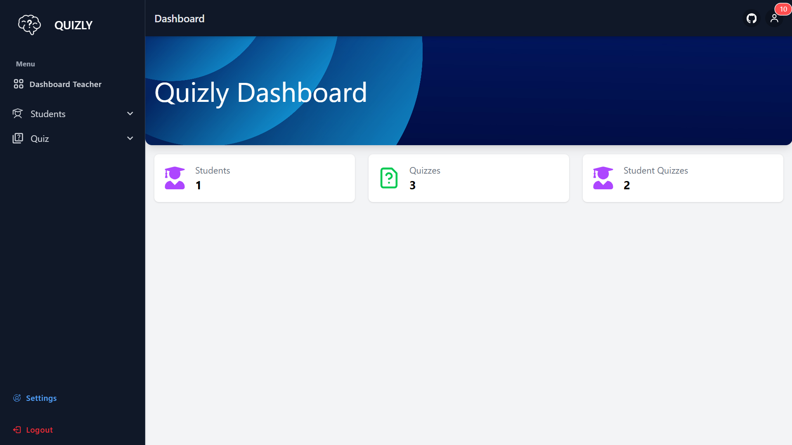
    <div style="display: grid; grid-template-columns: repeat(2, 1fr); gap: 10px;width: 100%;">
      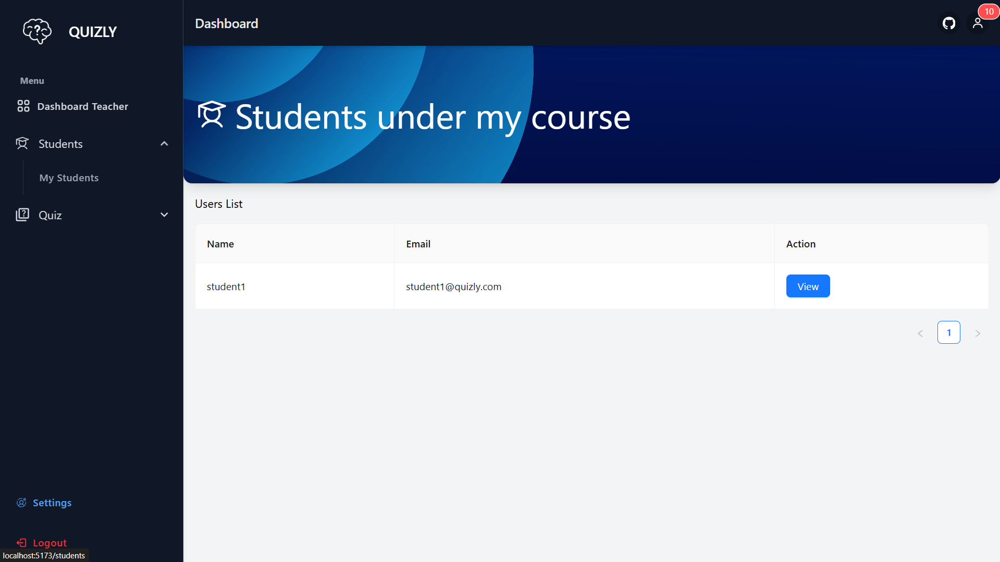
      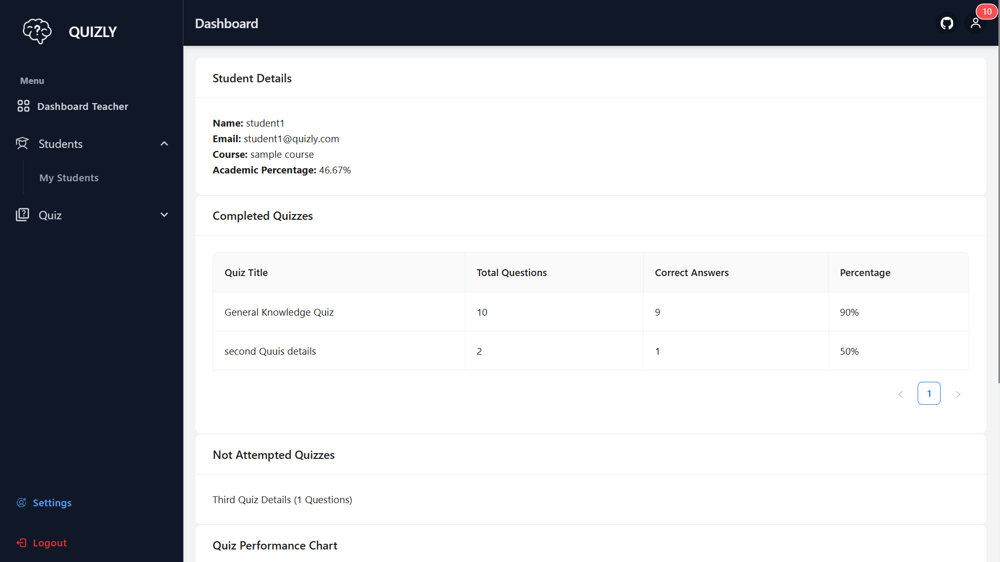
      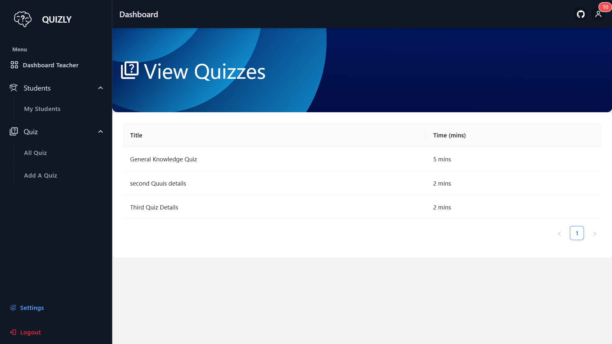
      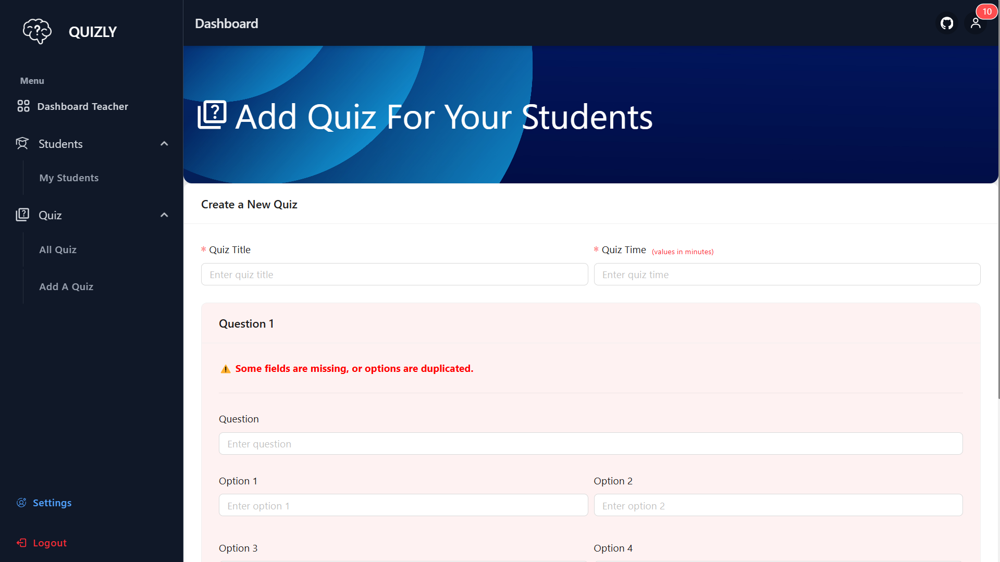
    </div>

4. Admin Dashboard 
    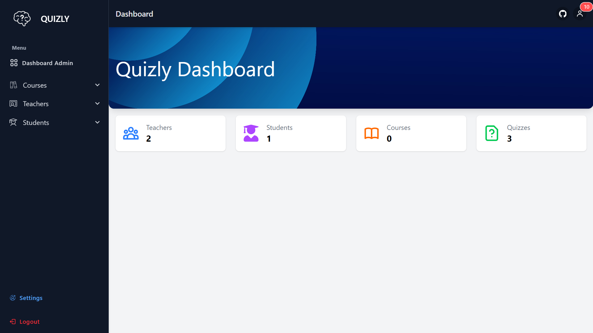
    <div style="display: grid; grid-template-columns: repeat(2, 1fr); gap: 10px;width: 100%;">
      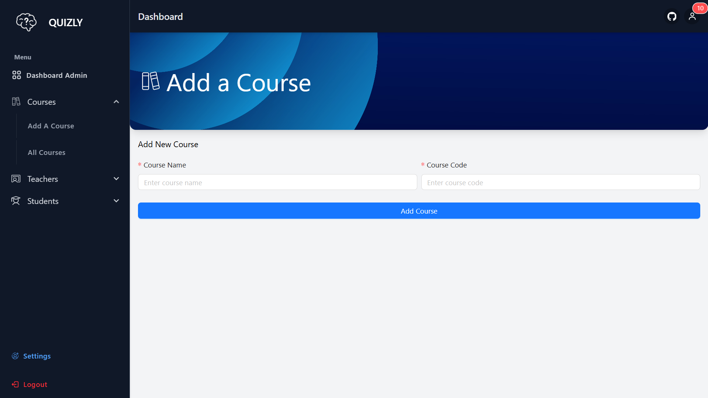
      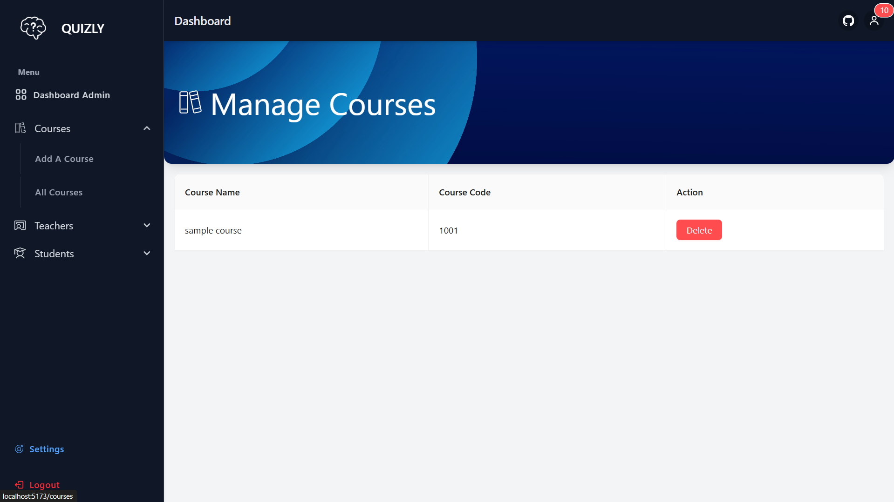
      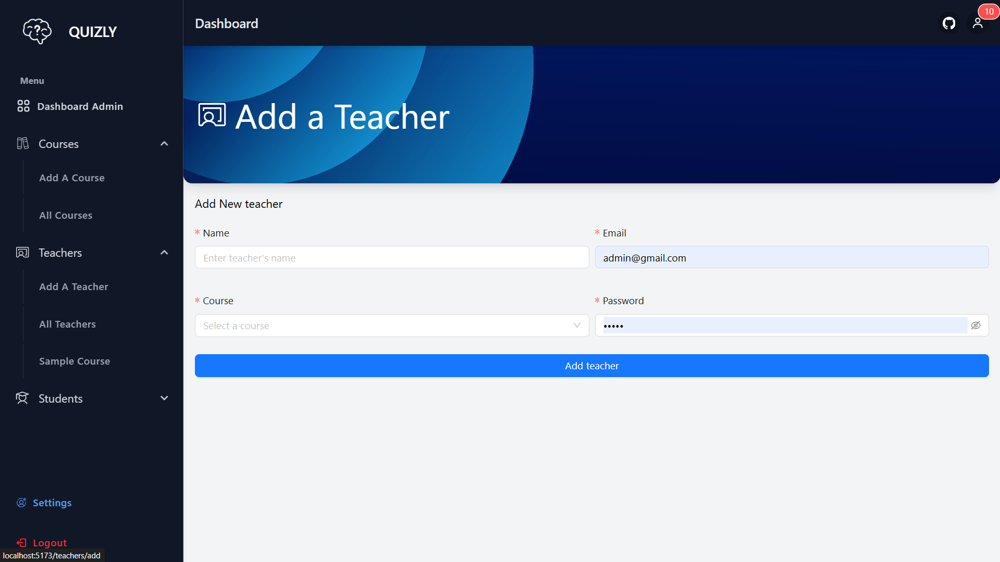
      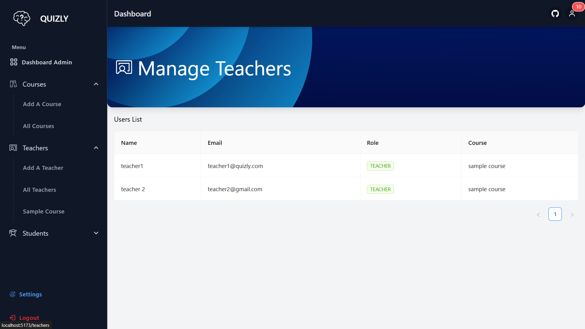
      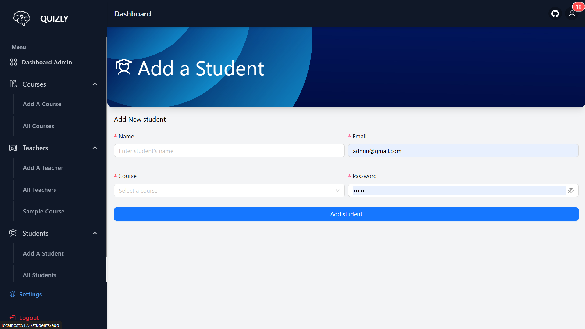
      
    </div>
---

## **👨‍💻 Development & Contribution**

If you wish to contribute, fork the repo, make changes, and submit a pull request.

📌 **Happy Coding! 🚀**
