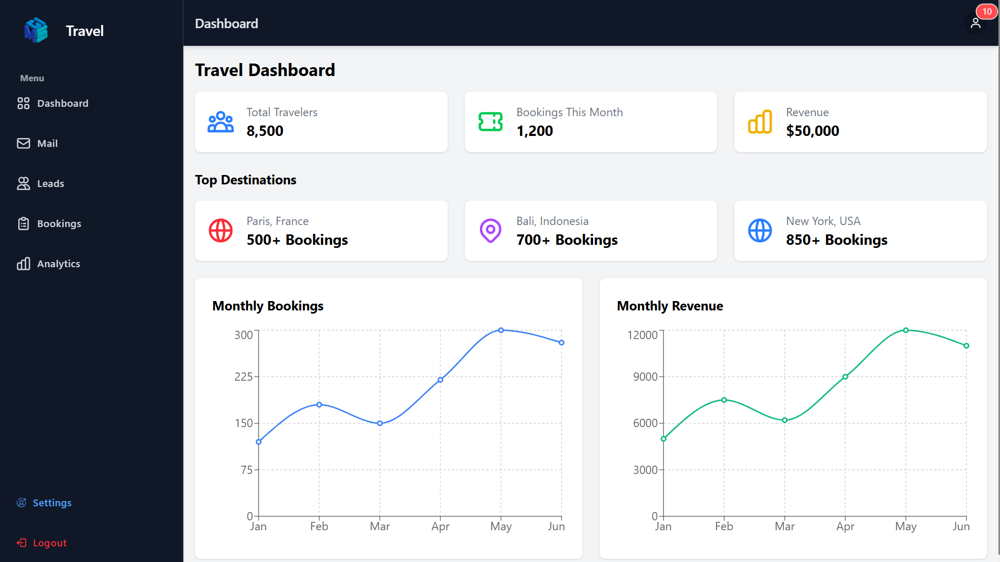
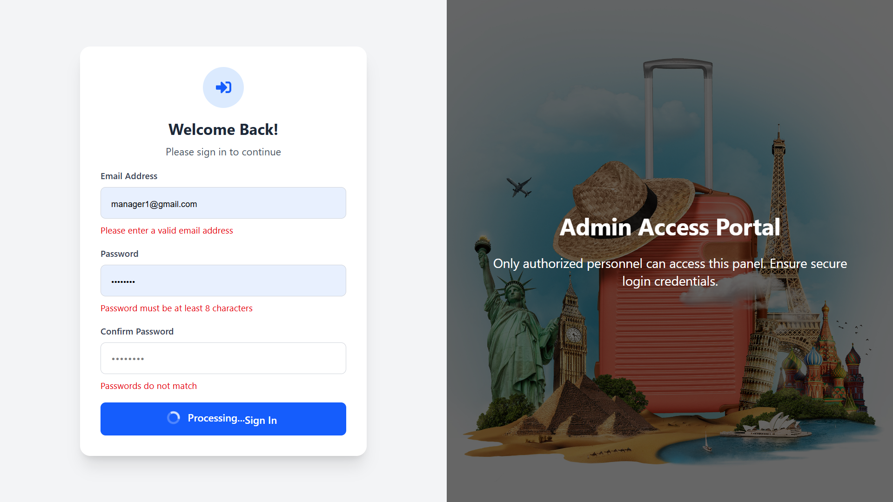
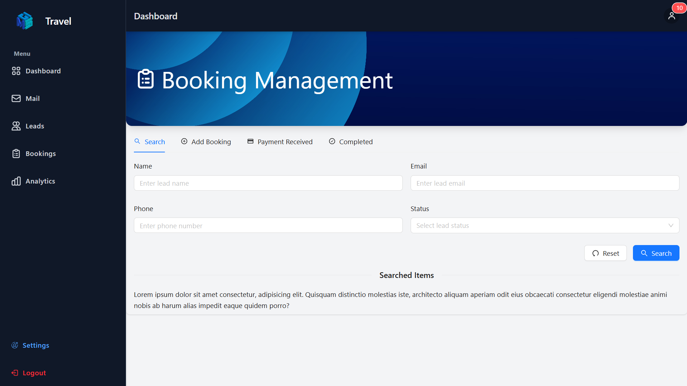
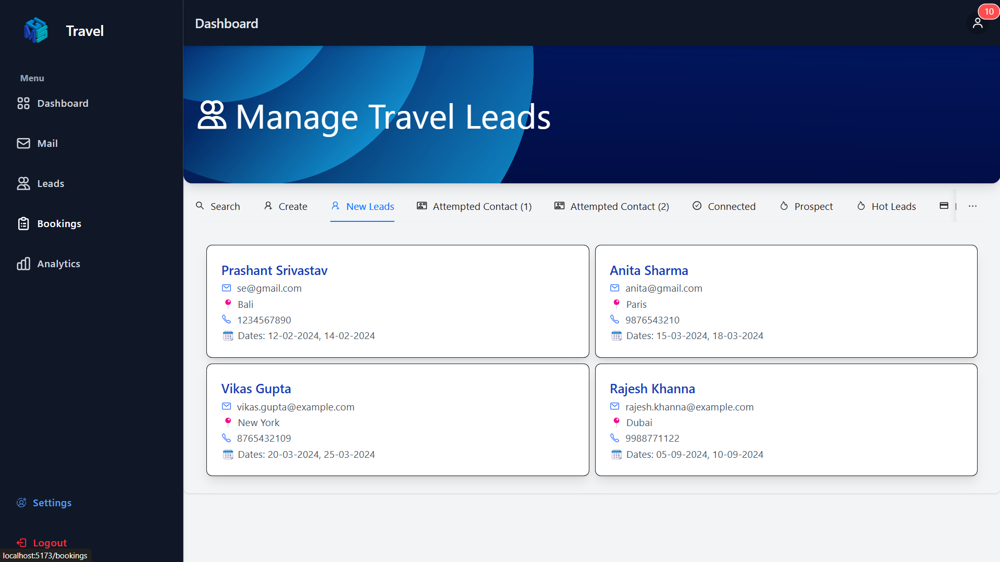

# 📊 React-Vite Dashboard



## 🚀 Overview
This is a **fully responsive** dashboard built using **React, Vite, TypeScript, and Tailwind CSS**. It provides a sleek and modern UI for analytics, user management, and real-time updates. Anyone can use it for their project or clone and customize it.

## 🌍 Live Demo
🔗 **[View Live Dashboard](https://template.dashboard.techorbitals.in)**  


- To log in, enter a valid email and a randomly generated password of at least 6 characters.

## 🛠 Tech Stack
- **React** + **Vite** for fast development
- **TypeScript** for better type safety
- **Tailwind CSS** for responsive and modern styling
- **Ant Design** for UI components (optional)
- **Recharts** for data visualization (graphs & charts)

## 🎨 Features
✅ **Responsive Layout** – Works on mobile, tablet, and desktop  
✅ **Modern UI** – Clean and user-friendly interface  
✅ **Dashboard Widgets** – Analytics, user stats, and reports  
✅ **Charts & Graphs** – Visual representation of data  
✅ **Reusable Components** – Easily extend for new features  

## 📸 Screenshot
  
  
  

## 🛠 Installation & Setup
1️⃣ **Clone the repository**
```sh
git clone https://github.com/sangamprashant/crm-dashboard-template-react.git
```
2️⃣ **Navigate to the project folder**
```sh
cd dashboard-template-react
```
3️⃣ **Install dependencies**
```sh
yarn install  # or npm install
```
4️⃣ **Run the development server**
```sh
yarn dev  # or npm run dev
```

## 📌 Usage
- Modify `src/components/` to customize UI elements.
- Update `src/pages/Dashboard.tsx` to add new widgets.
- Use `src/hooks/` for managing data fetching & state.

## 📢 Contributing
Feel free to contribute by opening **issues** or **pull requests**!

---

### 🌟 **Star this repo if you like it!** ⭐